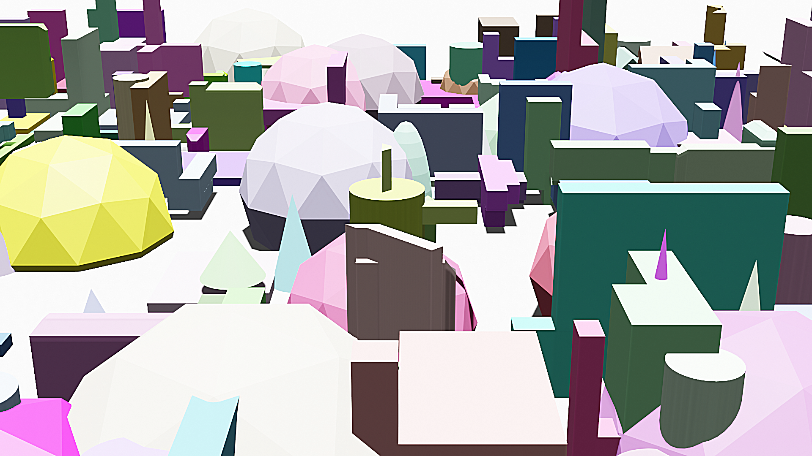

## Experimental U-Net for RGB hologram reconstruction

Takes in 4-channel RGBD image and output 3-channel RGB reconstructed image\
Outputs under `/saved_images`\
Inputs folders are specified under `/data`\
Run train.py to reconstruct input holograms\
Adjust hyperparameters in train.py
#### Sample Hologram

- `/train_depth` training depth images in grey scale 
- `/train_images` RGB input images, composited with depth as RGBD 
- `/train_masks` training groundtruth holograms
- `/val_depth` validation depth images
- `/val_images` validation RGB images
- `/val_masks` validation groundtruth

 